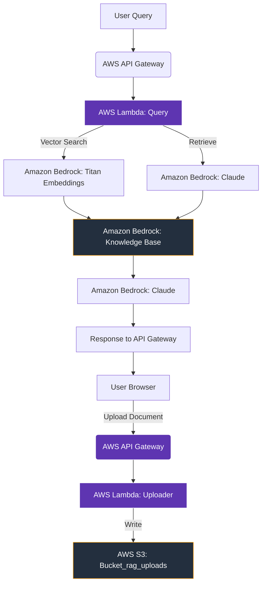

# AWS RAG Pipeline with LangChain and Bedrock

A complete serverless RAG (Retrieval-Augmented Generation) pipeline built with Python, deployed on AWS, and featuring a React frontend.

## Architecture



## 🏗️ Backend Setup

### Prerequisites

- Python 3.9+
- AWS CLI configured
- AWS Bedrock knowledge base created

### Installation

```bash
cd backend
pip install -r requirements.txt
```

### Deployment

Deploy the Lambda functions and API Gateway using the provided script:

```bash
python deploy.py
```

**Expected Output:**

```
============================================================
🚀 DEPLOYMENT SUMMARY
============================================================

📚 Upload Lambda

- ARN: arn:aws:lambda:us-east-1:917993967676:function:rag-uploader
- Endpoint: https://xx1xxx1xxx.execute-api.us-east-1.amazonaws.com/dev/upload
- Bucket: rag-frontend-bucket-911

📚 Query Lambda

- ARN: arn:aws:lambda:us-east-1:917993967676:function:rag-query
- Endpoint: https://xx1xxx1xxx.execute-api.us-east-1.amazonaws.com/dev/query
- KB: rag-knowledge-base-911


============================================================
 ✅ DEPLOYMENT COMPLETE
============================================================
```

## 🎨 Frontend Setup

### Prerequisites

- Node.js 18+
- npm

### Installation

```bash
cd frontend
npm install
```

### Configure API URLs

Update the API endpoints in `src/App.js` to match your deployed backend:

```javascript
const UPLOAD_API_URL = "https://xxxxxxxxx.execute-api.us-east-1.amazonaws.com/dev/upload";
const QUERY_API_URL = "https://xxxxxxxxx.execute-api.us-east-1.amazonaws.com/dev/query";
```

### Run Locally

```bash
npm start
```

## 🚀 Deploy to S3

To deploy the frontend as a static website on S3:

```bash
# Build the frontend
npm run build

# Deploy to S3
aws s3 sync build/ s3://rag-frontend-bucket-911

# Make public
aws s3 website s3://rag-frontend-bucket-911 --index-document index.html --error-document error.html

# Add bucket policy
aws s3api put-bucket-policy --bucket rag-frontend-bucket-911 --policy file://policy.json
```

**Policy JSON (`policy.json`):**

```json
{
    "Version": "2012-10-17",
    "Statement": [{
        "Sid": "PublicReadGetObject",
        "Effect": "Allow",
        "Principal": "*",
        "Action": "s3:GetObject",
        "Resource": "arn:aws:s3:::rag-frontend-bucket-911/*"
    }]
}
```

**Access URL:**

```
http://rag-frontend-bucket-911.s3-website-us-east-1.amazonaws.com
```

## 📝 Usage

1. **Upload Documents**: Click **Upload Document** and select PDF files from your computer.
2. **Ask Questions**: Type your questions in the chatbox and click **Send**.
3. **View Results**: The system will retrieve relevant information from your documents and provide an answer.

## 🔐 Security

- API Gateway uses IAM authentication for Lambda access
- Bedrock knowledge base uses AWS IAM roles for secure access
- S3 bucket is private with controlled access via Lambda

## 🛠️ Troubleshooting

### Frontend not loading
- Ensure `UPLOAD_API_URL` and `QUERY_API_URL` are set correctly
- Check browser console for CORS errors
- Verify S3 bucket policy is applied

### Backend errors
- Check CloudWatch logs for Lambda functions
- Verify Bedrock knowledge base is active
- Ensure IAM roles have necessary permissions

## 📁 Project Structure

```
aws-rag-pipeline/
├── backend/                    # Python backend
│   ├── lambda_uploader.py      # Upload Lambda
│   ├── lambda_query.py         # Query Lambda
│   ├── deploy.py               # Deployment script
│   ├── requirements.txt        # Dependencies
│   └── template.yaml           # CloudFormation template
│
├── frontend/                   # React frontend
│   ├── src/
│   ├── public/
│   ├── package.json
│   └── ...
│
└── README.md                   # Project documentation
```

## 🤝 Contributing

Contributions are welcome! Please feel free to submit a Pull Request.

## 📄 License

This project is licensed under the MIT License.